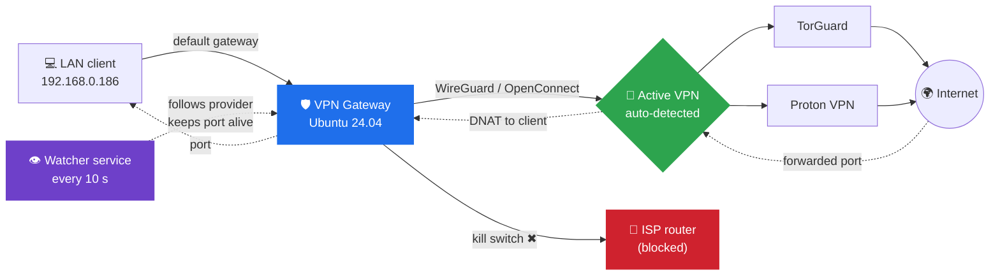

# vpn-gateway
🛡️ VPN gateway for your LAN with kill switch, port forwarding and auto-follow for TorGuard &amp; Proton VPN (NAT-PMP keep-alive). Live terminal dashboard.

<div align="center">

# 🛡️ VPN Gateway

**Turn an Ubuntu box into a VPN gateway for your LAN, with a kill switch, port forwarding and automatic provider detection.**

*TorGuard and Proton VPN, auto-detected. A live terminal dashboard. Zero hand-written iptables.*

[](#-changelog)
[](#-requirements)
[](vpn-gateway.sh)
[](#-supported-providers)
[](#-proton-vpn--the-port-that-stays-open)
[](LICENSE)

[Features](#-features) •
[How it works](#-how-it-works) •
[Quick start](#-quick-start) •
[The dashboard](#%EF%B8%8F-the-dashboard) •
[Proton VPN](#-proton-vpn--the-port-that-stays-open) •
[Testing](#-testing-the-kill-switch) •
[Troubleshooting](#-troubleshooting)

</div>

---

## ✨ What is this?

You want **one machine on your LAN**, such as a seedbox, web server or game server, to reach the internet **only through your VPN**. You also want the ports your VPN provider forwards to you to land **straight on that machine**.

`vpn-gateway.sh` builds the whole setup from a single colourful terminal dashboard: routing, NAT, port forwarding and a **kill switch**. Then it keeps it running. Switch from TorGuard to Proton VPN and the gateway **reconfigures itself**. Proton hands you a random port, and the gateway **keeps it open** and follows it when it changes.

> 💡 **Kill switch, in one line:** if the VPN goes down, your LAN client gets *no internet at all*. It never falls back to your ISP.

---

## 🚀 Features

| | Feature | What it does for you |
|---|---|---|
| 🔍 | **Auto-detect VPN** | Recognises TorGuard and Proton VPN and configures the gateway for whichever one is online |
| 🔁 | **Auto-follow** | Switch VPN provider and the gateway rebuilds itself within seconds, even with the script closed |
| 🔒 | **Kill switch** | LAN clients can only reach the internet through the VPN tunnel |
| 🔀 | **Port forwarding** | Forwarded ports go straight to your LAN client (TCP, UDP or both) |
| 🟣 | **Proton keep-alive** | Renews Proton's NAT-PMP port lease, so your port stays the same while connected |
| 🎯 | **Port follower** | Proton reconnect or new server? The new port is applied automatically |
| 🪝 | **On-change hook** | Run your own command when the Proton port changes (e.g. update qBittorrent) |
| 🖥️ | **Live dashboard** | Black-background terminal UI that refreshes every 5 seconds |
| 🧪 | **Kill switch test** | Counts the packets the gateway blocks to prove the kill switch works |
| 🧱 | **Gateway shielding** | Nothing on the VPN side can open connections to the gateway itself |
| 🚫 | **Leak protection** | Blocks IPv6 forwarding and ICMP redirects, two classic VPN leaks |
| 📏 | **MSS clamping** | Fixes the "some websites just hang" problem over WireGuard |
| 💾 | **Persistent rules** | Survives reboots, and the saved copy stays in sync when the provider switches |
| 🧯 | **Fail-closed** | If anything fails, forwarding stays blocked, so nothing leaks |
| 🤖 | **Headless mode** | `--apply` and `--detect` for scripts and SSH sessions |

---

## 🧭 How it works



1. **Outbound:** the client uses the gateway as its default route. The gateway forwards its traffic *only* into the VPN tunnel and masquerades it.
2. **Inbound:** connections arriving on your forwarded port(s) are DNAT'ed straight to the client.
3. **Kill switch:** any LAN traffic that doesn't go into the tunnel is dropped. VPN down means no internet for the client, and no leak.
4. **Watcher:** a small systemd service checks every 10 seconds which VPN actually carries the traffic. It rebuilds the gateway when you switch provider and keeps Proton's port alive.

---

## 🌐 Supported providers

| Provider | Detection | Port forwarding | Port changes |
|---|---|---|---|
| **TorGuard** | Interface name, OpenConnect, WireGuard config | Static, from the TorGuard portal | Only when you change it in the portal |
| **Proton VPN** | Interface name, NetworkManager connection, tunnel address | Dynamic, via NAT-PMP | On reconnect or server change, followed automatically |
| **Generic** | Any WireGuard or tun interface | Static | Manual |

Detection is based on **the interface your traffic actually leaves through**. Leftover tunnels from a provider you just disconnected can't confuse it, and a switch is only made after the same VPN has been seen twice in a row.

---

## 📋 Requirements

| Requirement | Notes |
|---|---|
| 🐧 **Ubuntu 24.04** | Desktop or Server (other Debian-based distros will probably work) |
| 🔑 **Root access** | Run with `sudo` |
| 🔐 **A VPN connection** | TorGuard (WireGuard / OpenConnect) and/or Proton VPN (app or WireGuard config) |
| 🖧 **Static LAN IPs** | For both the gateway and the client that receives the forwarded ports |
| 🟣 **Proton port forwarding** | Needs a **paid plan**, a **P2P server** and port forwarding / NAT-PMP enabled |
| 📦 **Packages** | `natpmpc` and `iptables-persistent` are installed automatically when needed |
| 🌍 **curl** *(optional)* | Shows your public IP through the tunnel in the status screen |

---

## ⚡ Quick start

```bash
# 1. Download
git clone https://github.com/MorphyDK/vpn-gateway.git
cd vpn-gateway

# 2. Make it executable
chmod +x vpn-gateway.sh

# 3. Connect your VPN, then run
sudo ./vpn-gateway.sh
```

Follow the setup order shown on the dashboard:

```
▶  Setup order:  1 Detect → 2 Settings → 3 Ports → 4 Build
```

1. **Detect** finds your VPN and picks the right provider settings.
2. **Settings**: check the LAN interface and the client IP.
3. **Ports**: enter your TorGuard ports. For Proton, there's nothing to enter.
4. **Build** creates the gateway, arms the kill switch and starts the watcher.
5. Press **9** to save the rules so they survive a reboot. ✅

### 🔧 Point your client at the gateway

On the LAN client (e.g. `192.168.0.186`), set:

- **Default gateway** → the gateway's LAN IP
- **DNS** → a public resolver or your VPN's DNS (see [DNS leaks](#%EF%B8%8F-dns-leaks))
- **IPv6** → disabled (see [IPv6](#-ipv6-the-sneaky-one))

---

## 🖥️ The dashboard

A live terminal UI with a black background and colour-coded status. It **refreshes every 5 seconds**, and menus react to a **single keypress**.

```
  ━━━━━━━━━━━━━━━━━━━━━━━━━━━━━━━━━━━━━━━━━━━━━━━━━━━━━━━━━━━━━━━━━━
   ▓▒░ V P N   G A T E W A Y  v1.0    // kill switch · port forwarding
  ━━━━━━━━━━━━━━━━━━━━━━━━━━━━━━━━━━━━━━━━━━━━━━━━━━━━━━━━━━━━━━━━━━

   VPN          ● UP    Proton VPN  proton0  10.2.0.2
   PORT         51234  NAT-PMP keep-alive · active · renewed 12 s ago
   KILL SWITCH  ● ARMED  protects LAN clients only - not this machine
   CLIENT       192.168.0.186  via ens18 192.168.0.10
   DETECTED     proton0 → Proton VPN (carries traffic)
   WATCHER      ● running  checks every 10 s · screen refreshes every 5 s

  ──────────────────────────────────────────────────────────────────
   SETUP
   [1]  Detect VPN provider
   [2]  Settings
   [3]  Proton port & keep-alive
   [4]  Build / rebuild gateway

   MONITOR
   [5]  Status & tunnel check
   [6]  Test kill switch
   [7]  View active rules
   [8]  View log

   MAINTENANCE
   [9]  Save rules persistently
   [R]  Remove gateway rules
   [Q]  Quit
  ──────────────────────────────────────────────────────────────────
  vpngw ❯ _
```

| Key | Option | Description |
|:-:|---|---|
| 1 | 🔍 **Detect VPN provider** | Scans the tunnels, identifies the provider and tests Proton's NAT-PMP |
| 2 | ⚙️ **Settings** | LAN card, provider, interfaces, client IP, port mode and protections |
| 3 | 🔀 **Ports** | TorGuard: change forwarded ports. Proton: port status, client port, hook |
| 4 | 🏗️ **Build / rebuild** | Shows a summary, then builds every rule with a live ✔ step list |
| 5 | 📊 **Status & tunnel check** | Tunnel state, public IP through the tunnel, client reachability, ports |
| 6 | 🧪 **Test kill switch** | 20-second test that counts the packets the gateway blocks |
| 7 | 📜 **View active rules** | Built-in pager with colours: ACCEPT green, DROP red, NAT magenta |
| 8 | 📝 **View log** | The last 300 lines of the log |
| 9 | 💾 **Save rules** | Installs `iptables-persistent` and saves the rules |
| R | 🧹 **Remove** | Clean removal of all rules, the watcher and IP forwarding |

### 🏗️ Build output

```
  ▌ BUILDING GATEWAY

  [ 1/10] Enabling IP forwarding             ✔ OK
  [ 2/10] Flushing old rules                 ✔ OK
  [ 3/10] Setting default policies           ✔ OK
  [ 4/10] Shielding gateway from VPN side    ✔ OK
  [ 5/10] Adding VPN forwarding rules        ✔ OK
  [ 6/10] Adding NAT masquerade              ✔ OK
  [ 7/10] Setting up port forwarding         ✔ OK
  [ 8/10] Arming kill switch                 ✔ OK
  [ 9/10] IPv6 block + MSS clamp             ✔ OK
  [10/10] VPN watcher service                ✔ OK
  ✔ Proton port received: 51234
```

---

## 🔁 Switching VPN provider

There's nothing to do. Just switch:

```
  ▌ VPN CHANGE DETECTED
   ONLINE NOW     Proton VPN on proton0
   CONFIGURED     TorGuard · torguard-wg tun0
  ✔ Settings switched to Proton VPN
  ...
  ✔ Proton port received: 51234
```

- **Script open:** the dashboard spots the change within about 5 seconds and rebuilds on screen.
- **Script closed:** the watcher service does the same in the background within about 10 seconds.
- **TorGuard ports are remembered** while you're on Proton, and come back when you switch back.
- **The kill switch stays armed throughout.** While the VPN switches, the client is briefly offline, never on your ISP.

You can turn this off under **Settings → A (Auto-follow VPN)**.

---

## 🟣 Proton VPN: the port that stays open

Proton gives you a **random port** through NAT-PMP, and it disappears if nobody renews it. The watcher handles that for you:

| Situation | What the gateway does |
|---|---|
| ✅ Connected | Renews the lease about every 40 s, so **the port stays the same** |
| 🔌 Disconnect | Closes the old port right away |
| 🌍 Reconnect or new server | Fetches the **new** port and updates the rules automatically |
| 🪝 Port changed | Runs your on-change hook with the new port as `$1` |

**Two ways to handle the random port on your client:**

- **📌 Fixed client port:** every Proton port is mapped to e.g. `8080` on your client. This is perfect for web servers.
- **🪝 On-change hook:** the client app follows the port. Torrent clients need this, because they announce their own port.

```bash
# Example hook: tell qBittorrent about the new port
#!/bin/bash
curl -s -X POST "http://192.168.0.186:8080/api/v2/app/setPreferences" \
     --data-urlencode "json={\"listen_port\": $1}"
```

---

## 🧪 Testing the kill switch

> ⚠️ **The kill switch protects your LAN clients, not the gateway itself.** A speedtest *on the gateway* still works with the VPN off, and that's by design: the gateway must always be able to reconnect the tunnel.

1. **Disconnect the VPN** on the gateway. Really disconnect it!
2. Press **6** in the menu and confirm with **y**.
3. During the 20-second countdown, **use the internet on the client**:
   ```bash
   ping -c 5 1.1.1.1
   curl -4 -m 5 https://ifconfig.me
   ```
4. Read the result:

```
  ▌ KILL SWITCH TEST - RESULT
    Tunnel: DOWN   |   via VPN: 0 pkts   |   blocked: 143 pkts

    KILL SWITCH WORKS: 143 packets from the LAN were blocked.
```

| Result | Meaning |
|---|---|
| ✅ **KILL SWITCH WORKS** | The gateway blocked everything. If pages still load on the client, that's IPv6 going around the gateway |
| ⚠️ **NO traffic reached this gateway** | The client isn't using the gateway: check its default gateway, IPv6, or whether you tested on the gateway itself |
| ℹ️ **Traffic is flowing through the VPN** | The VPN was still connected. Disconnect it and test again |

---

## 🔐 Security notes

### 🕳️ IPv6: the sneaky one

Your router probably hands out **IPv6 directly to the client**. That traffic never touches the gateway, so it **bypasses the VPN and the kill switch**, even while the tunnel is up. Disable IPv6 on the client or the router:

| Client | How |
|---|---|
| 🪟 Windows | Network adapter → Properties → untick *Internet Protocol Version 6* |
| 🐧 Linux | `sudo sysctl -w net.ipv6.conf.all.disable_ipv6=1` (make it permanent in `/etc/sysctl.d/`) |

Check it: `curl -6 ifconfig.me` on the client must **fail**.

### 🕳️ DNS leaks

If the client uses your **router** as DNS, those lookups go straight across the LAN to your ISP. Set the client's DNS to a **public resolver** or your **VPN's DNS**, so DNS also goes through the tunnel and the kill switch.

### 🛡️ Built-in protection

- **ICMP redirects disabled:** the gateway can't tell the client to "go direct to the router" when the tunnel drops.
- **IPv6 forwarding blocked:** no IPv6 path through the gateway.
- **VPN-side shield:** the internet can only reach your forwarded ports, never the gateway's own services.
- **Fail-closed:** a failed build leaves `FORWARD` on `DROP`.
- **Serialised rebuilds:** the dashboard and the watcher can never rebuild at the same time.

### ⚠️ Heads-up

The script **replaces all iptables rules** on the gateway. It warns you first if it finds:

- 🔥 **UFW**: its rules will be wiped. Installing `iptables-persistent` also **removes UFW**, and you're asked before that happens.
- 🐳 **Docker**: its rules will be wiped (restart Docker afterwards).

---

## 🤖 Command line

| Command | Description |
|---|---|
| `sudo ./vpn-gateway.sh` | Live interactive dashboard |
| `sudo ./vpn-gateway.sh --apply` | Rebuild from saved settings without menus |
| `sudo ./vpn-gateway.sh --detect` | List the detected VPN tunnels |
| `./vpn-gateway.sh --help` | Show usage |

```console
$ sudo ./vpn-gateway.sh --detect
INTERFACE      TYPE       ADDRESS         PROVIDER
proton0        wireguard  10.2.0.2        Proton VPN
```

---

## 📁 Files

| Path | Purpose |
|---|---|
| `/etc/vpn-gateway.conf` | Your saved settings (root only, `600`) |
| `/etc/sysctl.d/99-vpn-gateway.conf` | IP forwarding and leak protection |
| `/etc/iptables/rules.v4` / `rules.v6` | Persistent rules (once saved) |
| `/etc/systemd/system/vpn-gateway-keeper.service` | The background watcher |
| `/usr/local/sbin/vpn-gateway.sh` | Copy of the script used by the watcher (updated on every build) |
| `/run/vpn-gateway/keeper.state` | Live watcher state: port, tunnel, last renewal |
| `/var/log/vpn-gateway.log` | Full log of every action, switch and port change |

---

## 🩺 Troubleshooting

<details>
<summary><b>❌ Client has no internet</b></summary>

- Check the dashboard. Is the **VPN** line ● UP?
- If the VPN is down, that's the kill switch doing its job 🔒. Reconnect the VPN.
- Check that the client's default gateway is the gateway's LAN IP.

</details>

<details>
<summary><b>🔁 The gateway doesn't switch provider</b></summary>

- Look at the **DETECTED** line. If it says *"not followed automatically"*, the provider wasn't recognised. Use **1 Detect** manually.
- Check the **WATCHER** line shows ● running. If not, rebuild with **4**.
- Check that **Settings → A (Auto-follow)** is `yes`.
- Every switch is logged with its evidence: `sudo grep "Auto-follow" /var/log/vpn-gateway.log`

</details>

<details>
<summary><b>🟣 Proton port shows "NAT-PMP not answering"</b></summary>

- Port forwarding needs a **paid Proton plan** and a **P2P server**.
- Port forwarding / NAT-PMP must be **enabled** in the Proton app or WireGuard config.
- Try **3 → Request port now**.

</details>

<details>
<summary><b>🔌 Forwarded port not reachable from outside</b></summary>

- On the status screen, does **Ports in settings** match **Ports active now**? If not, use **3**.
- TorGuard: does the port match what the portal shows *right now*?
- Is the service on the client actually listening? Try `ss -tlnp` on Linux or `netstat -an` on Windows.
- Is the client's own firewall allowing the port?

</details>

<details>
<summary><b>🐌 Some websites load forever</b></summary>

That's an MTU problem. Make sure **Settings → M (MSS clamp)** is `yes`, then rebuild.

</details>

<details>
<summary><b>🧪 "Kill switch doesn't work"</b></summary>

- Did you **really disconnect** the VPN before testing? 😉
- Are you testing **on the client**, not on the gateway itself?
- Run **6 Test kill switch** and see what it reports.
- Does `curl -6 ifconfig.me` on the client return an IP? Then it's IPv6.

</details>

<details>
<summary><b>🔄 Rules gone after reboot</b></summary>

Use **9 Save rules persistently**. The status screen shows whether, and when, the rules were last saved.

</details>

---

## 🧹 Uninstall

```
sudo ./vpn-gateway.sh  →  R  Remove gateway rules
```

This flushes all rules, resets the policies to `ACCEPT`, turns IP forwarding off, removes the watcher service and optionally clears the saved rules. To remove everything else:

```bash
sudo rm /etc/vpn-gateway.conf /usr/local/sbin/vpn-gateway.sh /var/log/vpn-gateway.log
```

---

## 🗺️ Roadmap

- [ ] 🌐 Web dashboard (Cockpit plugin) to control the gateway from a browser
- [ ] 📡 `--status --json` and more CLI commands for automation
- [ ] 🔒 Optional host kill switch that also locks the gateway itself to the VPN
- [ ] ➕ More providers

---

## 📜 Changelog

| Version | Changes |
|---|---|
| **1.0** | 🎉 First public release: auto-detect and auto-follow for TorGuard and Proton VPN, Proton NAT-PMP keep-alive with a port follower, kill switch, port forwarding, live terminal dashboard, kill switch test, leak protection, watcher service |

---

## 📄 License

Released under the [MIT License](LICENSE). © 2026 MorphyDK

> **Disclaimer:** This project is not affiliated with or endorsed by TorGuard or Proton AG. Use at your own risk, and always test your kill switch before relying on it.

<div align="center">

**If this saved you some iptables headaches, consider giving it a ⭐**

Made with ☕ and a healthy fear of IP leaks

</div>

